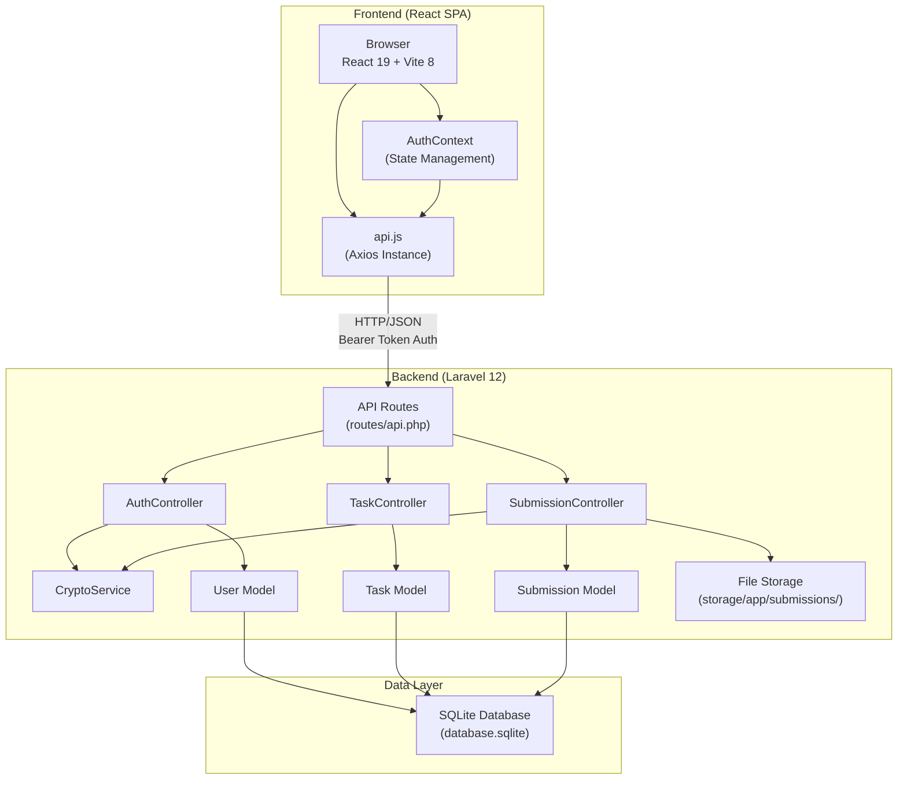
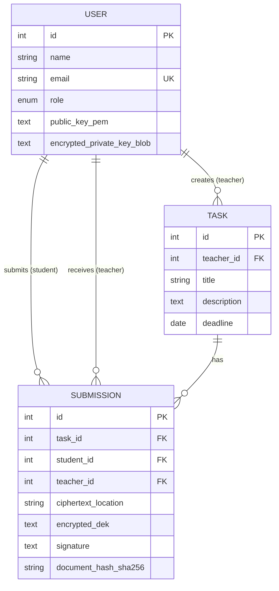

# Secure Academic Document System — Technical Report
### INSE 6110 Course Project — Comprehensive Code & Architecture Analysis

---

## 1. Project Overview

The **Secure Academic Document System (SecureDoc)** is a full-stack web application that implements a cryptographically secure document submission workflow for academic institutions. It enables students to submit assignments that are encrypted at rest using AES-256-GCM, with the symmetric key protected via RSA-OAEP key wrapping, and each submission digitally signed with RSA-PSS to provide non-repudiation guarantees.

### Core Security Properties Achieved

| Property | Mechanism | Algorithm |
|----------|-----------|-----------|
| **Confidentiality** | Symmetric encryption of document content | AES-256-GCM |
| **Key Confidentiality** | Asymmetric wrapping of DEK | RSA-3072-OAEP-SHA256 |
| **Integrity** | GCM authentication tag + SHA-256 hash comparison | AES-GCM tag + SHA-256 |
| **Non-Repudiation** | Digital signature over submission metadata | RSA-3072-PSS-SHA256 |
| **Authentication** | Token-based API authentication | Laravel Sanctum (Bearer tokens) |
| **Authorization** | Role-based access control | Middleware-enforced role checks |
| **Key-at-Rest Protection** | Private key encryption with password-derived key | PBKDF2-SHA256 (100K iterations) → AES-256-GCM |

---

## 2. Technology Stack

### Backend
| Component | Technology | Version |
|-----------|-----------|---------|
| Framework | Laravel | v12.x |
| Language | PHP | ≥ 8.2 |
| Auth System | Laravel Sanctum | v4.x |
| Cryptography Library | phpseclib3 | v3.x |
| Database | SQLite | File-based |
| Symmetric Crypto | OpenSSL (via PHP extension) | AES-256-GCM |

### Frontend
| Component | Technology | Version |
|-----------|-----------|---------|
| UI Framework | React | v19.x |
| Build Tool | Vite | v8.x |
| CSS Framework | Tailwind CSS | v4.x |
| HTTP Client | Axios | v1.x |
| Routing | React Router DOM | v7.x |
| Font | Inter (Google Fonts) | — |

---

## 3. System Architecture



### Communication Flow
- Frontend runs on `localhost:5173` (Vite dev server)
- Backend runs on `localhost:8000` (PHP artisan serve)
- CORS is configured to allow cross-origin requests from `localhost:5173`
- Authentication uses Bearer token scheme (Sanctum personal access tokens)
- The Axios interceptor automatically attaches the token from `localStorage` to every request

---

## 4. API Endpoints

| Method | Endpoint | Controller | Auth Required | Description |
|--------|----------|-----------|---------------|-------------|
| `POST` | `/api/register` | `AuthController@register` | No | User registration with RSA key pair generation |
| `POST` | `/api/login` | `AuthController@login` | No | Login with KEK derivation and private key decryption |
| `POST` | `/api/logout` | `AuthController@logout` | Yes | Invalidate current Sanctum token |
| `GET` | `/api/user` | Closure | Yes | Return authenticated user object |
| `GET` | `/api/tasks` | `TaskController@index` | Yes | List tasks (teachers: own tasks; students: all tasks) |
| `POST` | `/api/tasks` | `TaskController@store` | Yes (teacher/admin) | Create a new assignment task |
| `GET` | `/api/tasks/{task}` | `TaskController@show` | Yes | Get single task with teacher info |
| `GET` | `/api/submissions` | `SubmissionController@index` | Yes | List submissions (teacher: received; student: own) |
| `POST` | `/api/submissions/upload` | `SubmissionController@upload` | Yes (student) | Encrypt and upload a document |
| `GET` | `/api/submissions/{id}/download` | `SubmissionController@download` | Yes (teacher/admin) | Decrypt, verify, and download a document |

---

## 5. Database Schema

### 5.1 Users Table

```sql
CREATE TABLE users (
    id                          INTEGER PRIMARY KEY AUTOINCREMENT,
    name                        VARCHAR(255) NOT NULL,
    email                       VARCHAR(255) UNIQUE NOT NULL,
    email_verified_at           TIMESTAMP NULL,
    password                    VARCHAR(255) NOT NULL,          -- Bcrypt hash (12 rounds)
    
    -- Cryptographic Material --
    argon2_salt                 VARCHAR(32) NULL,               -- 16-byte salt as hex (for KEK derivation)
    public_key_pem              TEXT NULL,                      -- RSA-3072 public key (PKCS8/PEM)
    encrypted_private_key_blob  TEXT NULL,                      -- AES-256-GCM encrypted private key (base64)
    private_key_nonce           VARCHAR(255) NULL,              -- 12-byte AES-GCM nonce as hex
    
    -- Role & Metadata --
    role                        ENUM('student','teacher','admin') DEFAULT 'student',
    student_id                  VARCHAR(255) NULL,              -- e.g., STU-1234
    employee_id                 VARCHAR(255) NULL,              -- e.g., EMP-5678
    department                  VARCHAR(255) NULL,
    phone                       VARCHAR(255) NULL,
    last_login                  TIMESTAMP NULL,
    remember_token              VARCHAR(100),
    created_at                  TIMESTAMP,
    updated_at                  TIMESTAMP
);
```

### 5.2 Tasks Table

```sql
CREATE TABLE tasks (
    id          INTEGER PRIMARY KEY AUTOINCREMENT,
    teacher_id  INTEGER NOT NULL REFERENCES users(id) ON DELETE CASCADE,
    title       VARCHAR(255) NOT NULL,
    description TEXT NOT NULL,
    deadline    DATE NOT NULL,
    created_at  TIMESTAMP,
    updated_at  TIMESTAMP
);
```

### 5.3 Submissions Table

```sql
CREATE TABLE submissions (
    id                    INTEGER PRIMARY KEY AUTOINCREMENT,
    task_id               INTEGER NOT NULL REFERENCES tasks(id) ON DELETE CASCADE,
    student_id            INTEGER NOT NULL REFERENCES users(id) ON DELETE CASCADE,
    teacher_id            INTEGER NOT NULL REFERENCES users(id) ON DELETE CASCADE,
    
    -- File Metadata --
    original_filename     VARCHAR(255) NOT NULL,
    mime_type             VARCHAR(255) NOT NULL,
    file_size             BIGINT UNSIGNED NOT NULL,
    ciphertext_location   VARCHAR(255) NOT NULL,      -- Path on disk (e.g., submissions/uniqid.enc)
    status                VARCHAR(255) DEFAULT 'uploaded',
    
    -- AES-256-GCM Parameters --
    aes_nonce             VARCHAR(32) NOT NULL,        -- 12-byte nonce, base64 encoded
    aes_tag               VARCHAR(64) NULL,            -- Optional separate tag storage
    encrypted_dek         TEXT NOT NULL,               -- RSA-OAEP wrapped DEK, base64 encoded
    dek_wrap_algorithm    VARCHAR(255) DEFAULT 'RSA-OAEP-SHA256',
    content_algorithm     VARCHAR(255) DEFAULT 'AES-256-GCM',
    
    -- Digital Signature --
    signature             TEXT NOT NULL,               -- RSA-PSS signature, base64 encoded
    signature_algorithm   VARCHAR(255) DEFAULT 'RSA-PSS-SHA256',
    document_hash_sha256  VARCHAR(64) NOT NULL,        -- SHA-256 hex of original file + "|" + timestamp
    
    created_at            TIMESTAMP,
    updated_at            TIMESTAMP
);
```

---

## 6. Cryptographic Protocol Design

### 6.1 Registration Protocol

```
Registration(name, email, password, role):
    1. salt ← random_bytes(16)                              // 128-bit random salt
    2. password_hash ← Bcrypt(password, rounds=12)          // For standard login verification
    3. (SK, PK) ← RSA.KeyGen(3072)                          // RSA-3072 key pair in PKCS8 format
    4. KEK ← PBKDF2(SHA-256, password, salt, 100000, 32)    // 256-bit Key Encryption Key
    5. nonce ← random_bytes(12)                              // 96-bit AES-GCM nonce
    6. encrypted_SK ← AES-256-GCM.Encrypt(SK, KEK, nonce)   // Encrypt private key at rest
    7. Store(name, email, password_hash, role, hex(salt), PK, base64(encrypted_SK || tag), hex(nonce))
    8. Cache.put("private_key_user_{id}", SK, TTL=120min)    // Cache raw SK in server memory
    9. token ← Sanctum.CreateToken(user)
    10. Return (token, user)
```

### 6.2 Login Protocol

```
Login(email, password):
    1. user ← DB.FindByEmail(email)
    2. Verify Bcrypt(password, user.password_hash)           // Standard auth check
    3. salt ← hex2bin(user.argon2_salt)
    4. nonce ← hex2bin(user.private_key_nonce)
    5. KEK ← PBKDF2(SHA-256, password, salt, 100000, 32)    // Re-derive KEK
    6. SK ← AES-256-GCM.Decrypt(user.encrypted_SK, KEK, nonce)  // Decrypt private key
    7. If decryption fails → Return 500 "Key decryption failed"
    8. Cache.put("private_key_user_{id}", SK, TTL=120min)
    9. token ← Sanctum.CreateToken(user)
    10. Return (token, user)
```

### 6.3 Document Upload Protocol (The Core Cryptographic Workflow)

```
Upload(task_id, document_file):
    Student = authenticated user (must have role='student')
    Teacher = Task.find(task_id).teacher

    1. plaintext ← File.Read(document_file)
    2. document_hash ← SHA-256(plaintext)                       // Raw binary hash
    3. document_hash_hex ← Hex(document_hash)                   // Hex string for storage

    // Symmetric Encryption (Confidentiality)
    4. DEK ← random_bytes(32)                                   // One-time 256-bit AES key
    5. nonce ← random_bytes(12)                                 // 96-bit GCM nonce
    6. ciphertext || tag ← AES-256-GCM.Encrypt(plaintext, DEK, nonce)

    // Asymmetric Key Wrapping (Key Confidentiality)
    7. encrypted_DEK ← RSA-OAEP-SHA256.Encrypt(DEK, Teacher.PublicKey)

    // Digital Signature (Non-Repudiation)
    8. timestamp ← now().timestamp
    9. payload ← SHA-256(Student.id || "|" || Teacher.id || "|" || filename || "|" || timestamp || "|" || document_hash_hex)
    10. signature ← RSA-PSS-SHA256.Sign(payload, Student.PrivateKey)    // SK from cache

    // Persistence
    11. Disk.Write("submissions/{uniqid}.enc", base64(ciphertext || tag))
    12. DB.Insert(Submission{
            task_id, student_id, teacher_id,
            original_filename, mime_type, file_size,
            ciphertext_location,
            aes_nonce: base64(nonce),
            encrypted_dek: base64(encrypted_DEK),
            signature: base64(signature),
            document_hash_sha256: document_hash_hex || "|" || timestamp,
            status: "submitted"
        })

    13. Return 201 {message: "Document securely uploaded", submission}
```

### 6.4 Document Download & Verification Protocol

```
Download(submission_id):
    Teacher = authenticated user (must have role='teacher' or 'admin')
    Submission = DB.Find(submission_id)
    Verify: Submission.teacher_id == Teacher.id (or Teacher is admin)

    // Key Unwrapping
    1. encrypted_DEK ← base64_decode(Submission.encrypted_dek)
    2. nonce ← base64_decode(Submission.aes_nonce)
    3. signature ← base64_decode(Submission.signature)
    4. DEK ← RSA-OAEP-SHA256.Decrypt(encrypted_DEK, Teacher.PrivateKey)   // SK from cache

    // Decryption (Confidentiality Reversal)
    5. ciphertext_blob ← Disk.Read(Submission.ciphertext_location)
    6. plaintext ← AES-256-GCM.Decrypt(ciphertext_blob, DEK, nonce)
       // GCM automatically verifies the authentication tag — integrity check #1

    // Integrity Verification
    7. computed_hash ← Hex(SHA-256(plaintext))
    8. [stored_hash, timestamp] ← Split(Submission.document_hash_sha256, "|")
    9. Assert computed_hash == stored_hash                 // Integrity check #2
       If mismatch → throw "Document hash mismatch! Potential tampering."

    // Non-Repudiation Verification
    10. Student ← DB.FindUser(Submission.student_id)
    11. payload ← SHA-256(Student.id || "|" || Teacher.id || "|" || filename || "|" || timestamp || "|" || computed_hash)
    12. valid ← RSA-PSS-SHA256.Verify(payload, signature, Student.PublicKey)
    13. If !valid → Return 403 "CRITICAL: RSA Signature Verification Failed"

    // Success
    14. Return plaintext as file download with original MIME type and filename
```

---

## 7. File-by-File Code Walkthrough

### 7.1 Backend — `CryptoService.php`
[CryptoService.php](file:///d:/6110%20-%20Project/secure-academic-document-system/backend/app/Services/CryptoService.php)

This is the central cryptography engine. All cryptographic operations are encapsulated here:

| Method | Lines | Algorithm | Purpose |
|--------|-------|-----------|---------|
| `generateRSAKeyPair()` | 16–25 | RSA-3072, PKCS8 | Generates a new RSA key pair using phpseclib3 |
| `deriveKEK()` | 34–45 | PBKDF2-SHA256, 100K iterations | Derives a 256-bit key from password + salt |
| `encryptAESGCM()` | 56–75 | AES-256-GCM | Encrypts data, returns base64(ciphertext \|\| tag) |
| `decryptAESGCM()` | 77–100 | AES-256-GCM | Decrypts data, extracts last 16 bytes as auth tag |
| `wrapDEK()` | 109–117 | RSA-OAEP-SHA256 | Encrypts DEK with teacher's public key |
| `unwrapDEK()` | 126–134 | RSA-OAEP-SHA256 | Decrypts DEK with teacher's private key |
| `signPSS()` | 143–152 | RSA-PSS-SHA256 | Signs data with student's private key |
| `verifyPSS()` | 162–170 | RSA-PSS-SHA256 | Verifies signature using student's public key |

**Design Notes:**
- The GCM tag is appended to the ciphertext before base64 encoding (line 74), following the standard pattern
- During decryption, the tag is separated by taking the last 16 bytes (line 82)
- RSA padding is explicitly configured: `ENCRYPTION_OAEP` for key wrapping, `SIGNATURE_PSS` for signing
- Both hash and MGF hash are set to SHA-256 for all RSA operations

### 7.2 Backend — `AuthController.php`
[AuthController.php](file:///d:/6110%20-%20Project/secure-academic-document-system/backend/app/Http/Controllers/AuthController.php)

**Registration flow (lines 19–71):**
1. Validates input including role constraint to `{student, teacher, admin}`
2. Generates 16-byte cryptographic salt
3. Hashes password with Bcrypt (12 rounds) for standard auth
4. Generates RSA-3072 key pair via `CryptoService`
5. Derives KEK from plaintext password using PBKDF2
6. Encrypts private key with AES-256-GCM using the KEK
7. Creates user record with all cryptographic material
8. Caches raw private key in server memory for 120 minutes
9. Returns a Sanctum bearer token

**Login flow (lines 73–112):**
1. Standard Bcrypt credential verification
2. Re-derives KEK from the login password
3. Attempts to decrypt the stored private key blob
4. If AES-GCM decryption fails (wrong password = wrong KEK = tag verification failure), returns 500
5. Caches decrypted private key for 120 minutes
6. Updates `last_login` timestamp

### 7.3 Backend — `SubmissionController.php`
[SubmissionController.php](file:///d:/6110%20-%20Project/secure-academic-document-system/backend/app/Http/Controllers/SubmissionController.php)

**Upload (lines 30–94):** Implements the full cryptographic upload protocol described in §6.3.

Key implementation details:
- The signature payload (line 69) is a SHA-256 hash of a pipe-delimited string: `student_id|teacher_id|filename|timestamp|document_hash`
- The DEK is a fresh 32-byte random key per submission (line 58)
- The `document_hash_sha256` column stores both the hash and timestamp separated by `|` (line 90)

**Download (lines 96–153):** Implements the full verification protocol described in §6.4.

Key implementation details:
- Three-layer verification: (1) GCM tag verification during decryption, (2) SHA-256 hash comparison (line 132), (3) RSA-PSS signature verification (line 137)
- On signature failure, returns a 403 with explicit security alert message (line 141)
- On success, returns the raw plaintext as a downloadable file with correct MIME type (lines 145–148)

### 7.4 Backend — `TaskController.php`
[TaskController.php](file:///d:/6110%20-%20Project/secure-academic-document-system/backend/app/Http/Controllers/TaskController.php)

Simple CRUD controller:
- `index()`: Teachers see their own tasks; students see all tasks (with teacher name eager-loaded)
- `store()`: Only teachers/admins can create tasks
- `show()`: Returns a single task with teacher info

### 7.5 Backend — `UserFactory.php`
[UserFactory.php](file:///d:/6110%20-%20Project/secure-academic-document-system/backend/database/factories/UserFactory.php)

Database seeding uses the **real** `CryptoService` to generate cryptographically valid user records. Each factory-created user:
- Gets a unique RSA-3072 key pair (this makes seeding slow but realistic)
- Has their private key properly encrypted with AES-256-GCM
- Uses password `"1234567890"` as the KEK derivation password

### 7.6 Frontend — `AuthContext.jsx`
[AuthContext.jsx](file:///d:/6110%20-%20Project/secure-academic-document-system/frontend/src/context/AuthContext.jsx)

React Context provider that manages authentication state:
- Persists user object to `localStorage` for page refreshes
- Stores Sanctum bearer token in `localStorage`
- Provides `login()`, `register()`, and `logout()` functions to all child components
- On logout, clears both localStorage entries and calls the server logout endpoint

### 7.7 Frontend — `api.js`
[api.js](file:///d:/6110%20-%20Project/secure-academic-document-system/frontend/src/services/api.js)

Axios instance configuration:
- Base URL: `http://localhost:8000/api`
- **Request interceptor**: Automatically attaches `Authorization: Bearer {token}` header from localStorage
- **Response interceptor**: On 401 responses, clears localStorage and redirects to `/login` (global session expiry handling)

### 7.8 Frontend — `App.jsx`
[App.jsx](file:///d:/6110%20-%20Project/secure-academic-document-system/frontend/src/App.jsx)

Application routing structure:
- **Public routes**: `/login`, `/register`, `/reset-password`
- **Protected routes**: Wrapped in `ProtectedPage` which combines `ProtectedRoute` (auth + role check) with `DashLayout` (sidebar + navbar)
- **Role-based routing**: `DashboardRouter` renders different dashboard components based on `user.role`
- **Catch-all**: Any unknown route redirects to `/login`

### 7.9 Frontend — `UploadAssignment.jsx`
[UploadAssignment.jsx](file:///d:/6110%20-%20Project/secure-academic-document-system/frontend/src/pages/student/UploadAssignment.jsx)

Key features:
- **Drag-and-drop** file selection with visual feedback
- **Cryptographic engine animation** (lines 13–22, 119–137): Simulates client-side crypto steps with 600ms delays per stage for demonstration purposes
- Sends the file as `multipart/form-data` to the backend where real encryption occurs
- Post-upload success screen displays the algorithms used

### 7.10 Frontend — `TeacherDashboard.jsx`
[TeacherDashboard.jsx](file:///d:/6110%20-%20Project/secure-academic-document-system/frontend/src/pages/teacher/TeacherDashboard.jsx)

Key features:
- **Two-tab interface**: "Assignment Tracking" (task overview) and "Cryptographic Submissions" (decrypt/verify)
- **Cryptographic verification animation** (lines 45–52, 56–93): Displays step-by-step logs during download showing RSA unwrapping, AES decryption, tag verification, hash computation, and PSS signature verification
- Downloads decrypted files as blob URLs via `window.URL.createObjectURL`
- On verification failure, displays a critical alert

### 7.11 Frontend — `Profile.jsx`
[Profile.jsx](file:///d:/6110%20-%20Project/secure-academic-document-system/frontend/src/pages/shared/Profile.jsx)

Privacy-oriented profile page:
- Email and phone are **masked by default** using `maskEmail()` and `maskPhone()` helpers
- Click the eye icon to **temporarily reveal** (auto-hides after 10 seconds via `setTimeout`)
- Role-colored avatar badge using role-specific color tokens (`--color-student`, `--color-teacher`, `--color-admin`)

---

## 8. Design System & Theming

Defined in [index.css](file:///d:/6110%20-%20Project/secure-academic-document-system/frontend/src/index.css) using Tailwind CSS v4 `@theme` directive:

| Token | Value | Usage |
|-------|-------|-------|
| `--color-primary` | `#0d9488` (Teal) | Primary buttons, links, active states |
| `--color-primary-light` | `#14b8a6` | Avatar backgrounds, hover states |
| `--color-primary-dark` | `#0f766e` | Button hover states |
| `--color-student` | `#3b82f6` (Blue) | Student role badges |
| `--color-teacher` | `#8b5cf6` (Purple) | Teacher role badges |
| `--color-admin` | `#f59e0b` (Amber) | Admin role badges |
| `--color-success` | `#10b981` (Emerald) | Success states, verified status |
| `--color-warning` | `#f59e0b` (Amber) | Warning alerts, pending status |
| `--color-danger` | `#ef4444` (Red) | Errors, overdue states |
| `--color-sidebar` | `#1e293b` (Slate-800) | Sidebar background |
| `--color-bg` | `#f8fafc` (Slate-50) | Page background |
| `--color-card` | `#ffffff` | Card surfaces |

---

## 9. Security Analysis

### Strengths
1. **Proper key hierarchy**: DEK → KEK → Password derivation chain prevents key exposure
2. **Authenticated encryption**: AES-256-GCM provides both confidentiality and integrity
3. **Non-repudiation**: RSA-PSS signatures are cryptographically bound to submission metadata
4. **Key-at-rest protection**: Private keys are never stored in plaintext in the database
5. **OWASP-compliant KDF**: PBKDF2 with 100,000 iterations meets OWASP recommendations
6. **Algorithm metadata storage**: Each submission records which algorithms were used (`dek_wrap_algorithm`, `content_algorithm`, `signature_algorithm`), enabling future algorithm migration

### Known Limitations
1. **Server-side key caching**: The decrypted private key is held in server cache (potentially in plaintext memory) for 120 minutes
2. **No client-side encryption**: All cryptographic operations happen server-side; the file travels unencrypted over HTTPS to the server
3. **Password reset**: The password reset flow is currently simulated (frontend-only, not connected to the backend); changing passwords would require re-encrypting all private keys
4. **PBKDF2 vs Argon2id**: The code comments mention Argon2id but actually uses PBKDF2 as a polyfill because `libsodium` is not enabled
5. **No key rotation mechanism**: There is no procedure for rotating RSA keys or re-wrapping existing DEKs

---

## 10. Eloquent Relationships



| Model | Relationship | Type |
|-------|-------------|------|
| `Task → User` | `belongsTo(User, 'teacher_id')` | Many-to-One |
| `Task → Submission` | `hasMany(Submission)` | One-to-Many |
| `Submission → User` | `belongsTo(User, 'student_id')` | Many-to-One |
| `Submission → Task` | `belongsTo(Task)` | Many-to-One |

---

## 11. Frontend Component Hierarchy

```
App (BrowserRouter + AuthProvider)
├── Login → AuthLayout
├── Register → AuthLayout
├── PasswordReset → AuthLayout
└── ProtectedPage (ProtectedRoute + DashLayout)
    ├── DashLayout
    │   ├── Sidebar (role-based nav items)
    │   └── Navbar (page title + welcome message)
    ├── DashboardRouter → role-based rendering
    │   ├── StudentDashboard (stats, tasks, submissions)
    │   ├── TeacherDashboard (stats, tabs, decrypt/verify)
    │   └── AdminDashboard (system-wide stats)
    ├── UploadAssignment (drag-drop, crypto animation)
    ├── CreateTask (form)
    └── Profile (masked PII, edit mode)
```

---

## 12. Running the Application

### Backend
```bash
cd backend
composer install
php artisan migrate
php artisan db:seed          # Creates 5 students + 1 teacher + 1 admin
php artisan serve            # Starts on http://localhost:8000
```

### Frontend
```bash
cd frontend
npm install
npm run dev                  # Starts on http://localhost:5173
```

### Demo Credentials (from seeder)
| Role | Email | Password |
|------|-------|----------|
| Teacher | `teacher@example.com` | `1234567890` |
| Admin | `admin@example.com` | `1234567890` |
| Student | *(any seeded user)* | `1234567890` |

---

## 13. Summary of All Implemented Features

| Feature | Status | Description |
|---------|--------|-------------|
| User Registration with RSA Key Generation | ✅ | Full crypto key lifecycle on registration |
| User Login with Key Decryption | ✅ | KEK derivation + AES-GCM private key decryption |
| Role-Based Dashboards | ✅ | Student, Teacher, Admin views |
| Task CRUD | ✅ | Teachers create tasks, students view all |
| Secure Document Upload (AES+RSA+PSS) | ✅ | Full encryption + signing pipeline |
| Secure Document Download (Decrypt+Verify) | ✅ | Full decryption + integrity + signature verification |
| Cryptographic Progress Visualization | ✅ | Animated step-by-step crypto UI during upload/download |
| Profile with PII Masking | ✅ | Auto-hiding email/phone reveal |
| Password Strength Meter | ✅ | Visual indicator during registration |
| Protected Routes + Role Guards | ✅ | Frontend route protection |
| Token-Based Authentication (Sanctum) | ✅ | Bearer token with global 401 handling |
| Password Reset Flow | ⚠️ Partial | Frontend UI complete, backend not connected |
| Admin User Management | ⚠️ Partial | Shows stats only, no CRUD operations |
